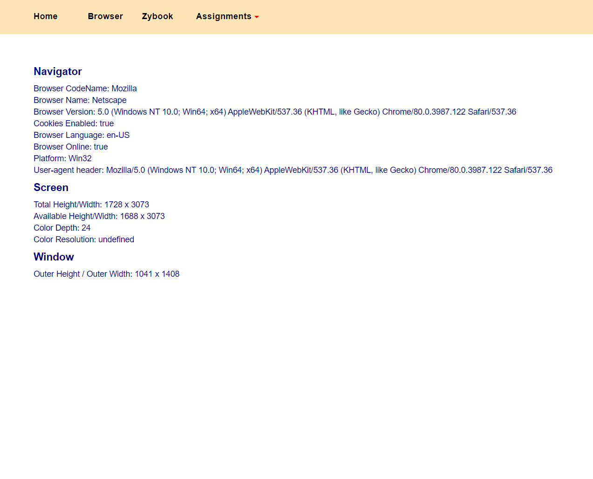

### Information Technology - CS355

##### Projects related to a course called Information Technology covering everything from the TCP/IP Model and internet addressing to routing, network technology and web development. The simple website includes three web tools: a browser information tool, a url analyzer, and an IP manager.

